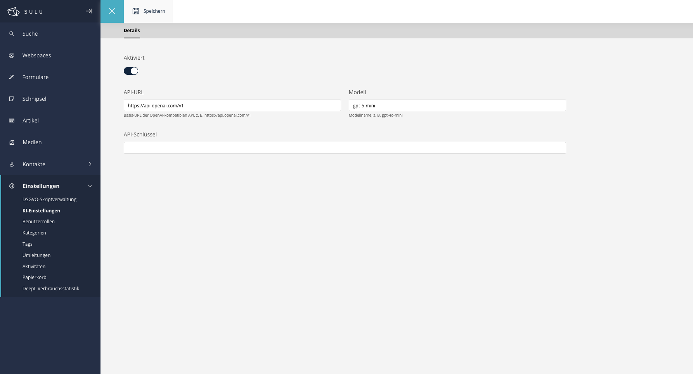
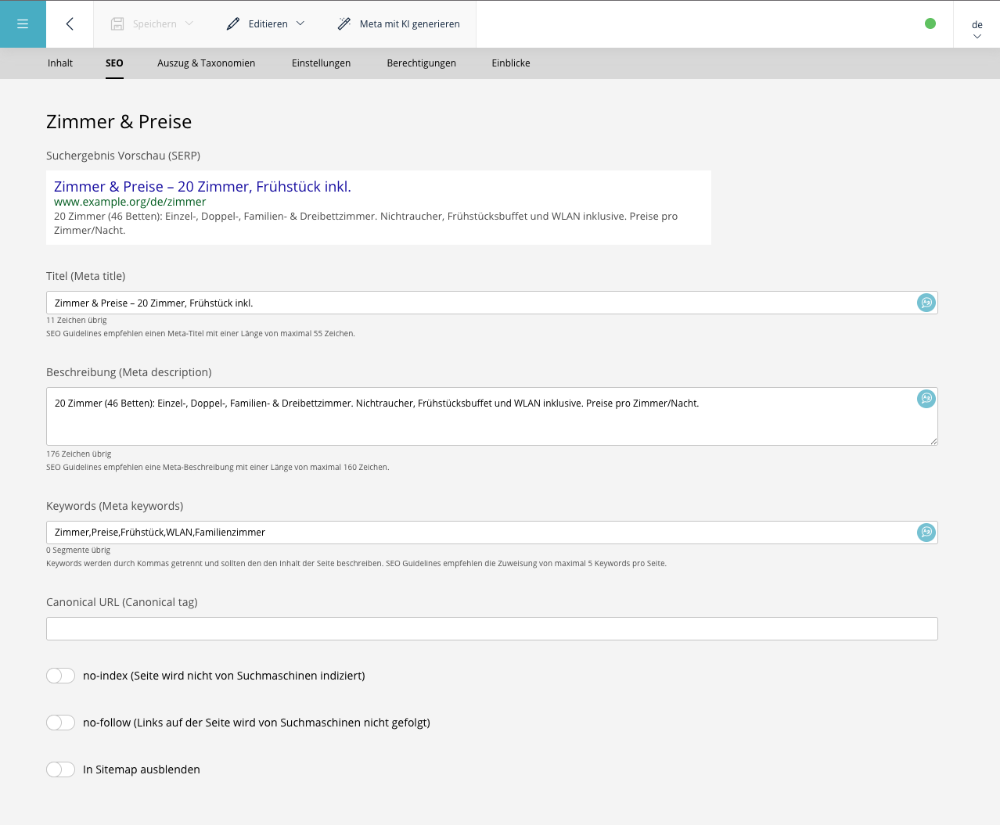

# SuluAIBundle

AI features for [Sulu](https://sulu.io/) 3.

- A **Settings** page (Settings → AI Settings) to configure an OpenAI-compatible
  API (base URL, model, API key, enabled toggle).
- A **Generate meta with AI** button on a page's **Meta / SEO** tab that sends the
  saved page's content to the API and fills the meta title, description and
  keywords.
- An **AI Assistant** available on every admin view: a floating chat that finds
  content (pages, snippets, articles and forms) and opens the right edit view
  after the user confirms with a click. On a page's content tab it additionally
  understands the page and its template's content blocks and edits the page via
  chat — every change is shown as a diff and only applied after approval.
- An **AI Image Generator** reachable from the media library toolbar and the
  media-selection popup: generate images from a prompt (with style, format,
  resolution, purpose, model selection and optional reference images) through
  the configured endpoint; results are saved into an **"AI Created"**
  collection.



## Requirements

* PHP >= 8.2
* Sulu >= 3.0
* Symfony >= 6.4

## Installation

```bash
composer require marcostastny/sulu-ai-bundle
```

Register the bundle in `config/bundles.php`:

```php
return [
    /* ... */
    Marcostastny\SuluAIBundle\SuluAIBundle::class => ['all' => true],
];
```

Import the admin API routes in `config/routes_admin.yaml`:

```yaml
sulu_ai_admin_api:
    resource: '@SuluAIBundle/Resources/config/routing_admin.yaml'
    prefix: /admin/api
```

Update the schema (Sulu uses the admin kernel):

```bash
bin/adminconsole doctrine:schema:update --force
```

Register the admin JS package in `assets/admin/package.json` (the path must
point into the installed bundle under `vendor/`):

```json
{
    "dependencies": {
        "sulu-ai-bundle": "file:../../vendor/marcostastny/sulu-ai-bundle/src/Resources/js"
    }
}
```

Import it in your `assets/admin/index.js` (or `app.js`) and rebuild:

```js
import "sulu-ai-bundle";
```

```bash
cd assets/admin && npm install && npm run build
```

> **Note on updates:** npm copies `file:` dependencies into `node_modules` and
> pins the resolved path in `package-lock.json`. After updating the bundle (or
> if the import ever points at a stale location), refresh it explicitly:
>
> ```bash
> cd assets/admin
> npm install sulu-ai-bundle@file:../../vendor/marcostastny/sulu-ai-bundle/src/Resources/js
> npm run build
> ```

Finally clear the admin cache:

```bash
bin/adminconsole cache:clear
```

## Permissions

The bundle registers three security contexts in a single **AI** section under
*Settings → Roles*, so you can let content editors use the AI features without
giving them access to the API key:

| Context | Grants |
|---|---|
| `sulu_ai.settings` | **View/Edit** the settings page (API URL, key, model) |
| `sulu_ai.meta_generation` | **View** to show and use the *Generate meta with AI* button on pages |
| `sulu_ai.assistant` | **View** to show and use the assistant chat (globally and on page edit forms) |
| `sulu_ai.image_generation` | **View** to show and use the image generator (requires image models configured in AI Settings) |

Grant the relevant permissions to each role under *Settings → Roles*. The
generate-meta button and the assistant only appear for users who have **View**
on the respective context, and the endpoints enforce the same permissions.

## Usage

### AI Settings

Open **Settings → AI Settings**, enter the API URL (e.g.
`https://api.openai.com/v1`), model (e.g. `gpt-4o-mini`) and API key, toggle
**Enabled**, and save. All AI features share this configuration.

### Meta generation

1. Open a page, **save** it, then open its **Meta / SEO** tab.
2. Click **Generate meta with AI**. The title, description and keywords fields
   are filled from the page's content (in the current content language). Review
   and save.



The button is disabled until the page has been saved at least once (the backend
reads the saved page content).

### AI Assistant

Users with the **AI Assistant** permission see a floating chat button in the
bottom-right corner of every admin view (as soon as AI is enabled in the
settings).

**Finding and opening content (all views):** ask for content in natural
language — "I want to edit the table reservation form". The assistant searches
pages, snippets, articles and forms (only content you may edit) and answers
with a result card. Clicking **Open** navigates to the edit view — never
automatically, and Sulu's unsaved-changes dialog still protects a dirty form.
The conversation survives navigation; the trash icon in the header clears it.

**Editing pages (content tab):**

1. Open a page's **Content** tab.
2. Ask questions ("What is this page about?") or request changes ("Rewrite the
   intro", "Add a text block about breakfast times", "Move the quote block to
   the top"). The assistant sees the current — including unsaved — form content
   and the template's block schema.
3. Requested changes appear as a **diff card** in the chat (old value / new
   value, block insertions, removals and moves). Click **Apply** to write them
   into the open form, or **Discard** to reject them.
4. Applied changes are only in the form — review them and use Sulu's normal
   **Save**/**Publish** to persist. If the form changed after a proposal was
   made, applying it shows a conflict warning instead of corrupting the page.

**Multi-step tasks & tab switching:** the assistant also works on the page
**SEO** tab and can carry a task across several approved steps. Ask for an SEO
change while on the Content tab and it offers a **tab switch card**; if the
form has unsaved changes, it asks to **save & switch** first. After each
approved step (page opened, tab switched, diff applied) the assistant
automatically continues with the next one — e.g. "update the room prices by
20%" asked from anywhere searches the page, offers to open it, and proposes
the edits once you are there. Rejecting any step (Discard/Cancel) aborts the
whole task; automatic continuations are capped so the loop can never run away.

### Image generator

1. In **AI Settings**, add one or more **Image models** (label + model id as the
   endpoint expects, e.g. via a LiteLLM proxy; toggle *Supports reference
   images* where applicable) and optionally a **Company image style prompt**.
2. In the media library (or any media-selection popup) click **Generate image
   (AI)**. Enter a prompt, pick options and one or more models, and generate.
3. Generated images are saved into the **"AI Created"** collection; select them
   from there as usual.

## How it works

**Meta generation** posts the page id + locale to
`POST /admin/api/ai/generate-meta`. The controller loads the saved page
server-side (`PageRepositoryInterface` + `ContentManagerInterface`), flattens
its content to plain text, calls the configured chat-completions endpoint, and
returns `{title, description, keywords}` which the button writes into the SEO
fields.

**AI Assistant** posts the page's live form data + message history to
`POST /admin/api/ai/assistant/chat`. The controller builds a system prompt from
the template metadata, runs an OpenAI function-calling loop server-side, and
validates every proposed edit operation against the template schema before it
reaches the browser.

Outside a page form the same endpoint runs in global mode: the agent may call
a `search_content` tool (backed by Sulu's SEAL admin search index, filtered by
the user's permissions, plus a Doctrine lookup for forms) and can only propose
navigation targets that this tool actually returned — the browser then renders
them as buttons and navigates via the admin router on click.

In both cases the API key never leaves the server.

**Image generation** posts one request per selected model to
`POST /admin/api/ai/image/generate`. The controller reuses the configured API
URL + key, builds the prompt (prompt + style + purpose + company style prompt)
and the `size` parameter, calls the OpenAI-compatible images endpoint
(`/images/generations`, or `/images/edits` when reference images are supplied),
and saves each result into the "AI Created" collection via Sulu's MediaManager.
